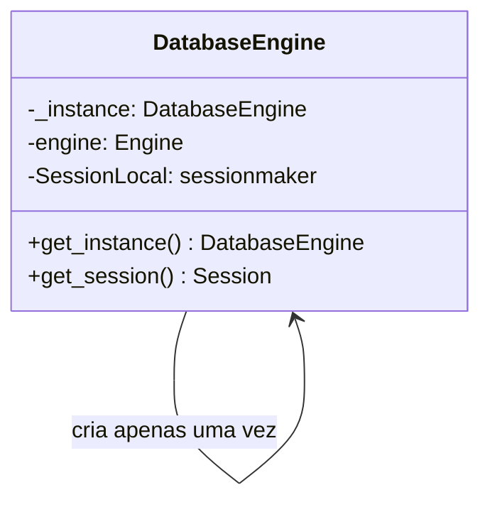
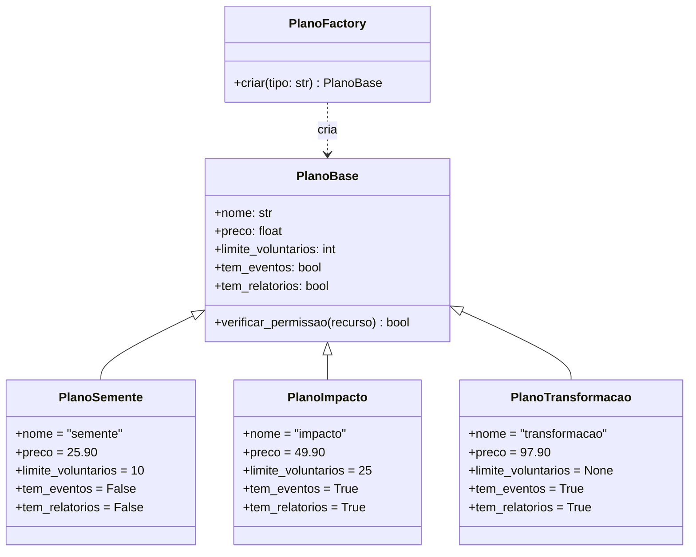
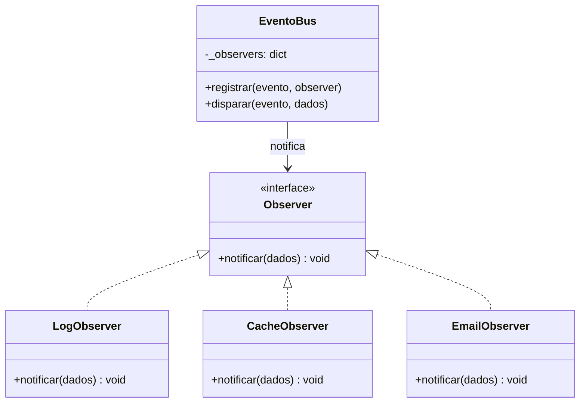
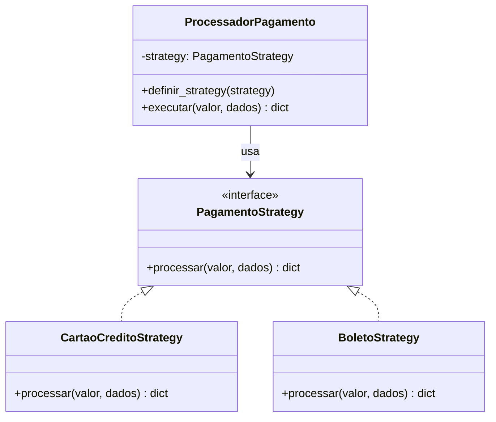

# Padrões de Projeto GoF — Hub Social

Foram identificados e aplicados **4 padrões GoF** no sistema, cobrindo as três categorias.

---

## Padrão 1 — Singleton (Criacional)

### Problema resolvido
A conexão com o banco de dados SQLite/MySQL é cara de criar. Sem controle, cada requisição poderia abrir uma nova conexão, esgotando os recursos do servidor. O Singleton garante que **apenas uma instância do engine do banco** seja criada durante toda a vida da aplicação.

### Onde aparece no Hub Social
O objeto `engine` do SQLAlchemy é criado uma única vez na inicialização e reutilizado por todas as sessões de banco de dados.

### Diagrama UML (Mermaid)



### Código Python

```python
from sqlalchemy import create_engine
from sqlalchemy.orm import sessionmaker

class DatabaseEngine:
    """
    Singleton: garante uma única instância do engine do banco.
    """
    _instance = None

    def __new__(cls):
        if cls._instance is None:
            cls._instance = super().__new__(cls)
            cls._instance.engine = create_engine(
                "sqlite:///./hubsocial.db",
                connect_args={"check_same_thread": False}
            )
            cls._instance.SessionLocal = sessionmaker(
                autocommit=False,
                autoflush=False,
                bind=cls._instance.engine
            )
        return cls._instance

    def get_session(self):
        return self.SessionLocal()


# Em qualquer parte da aplicação, sempre retorna o mesmo objeto:
db1 = DatabaseEngine()
db2 = DatabaseEngine()
print(db1 is db2)  # True
```

---

## Padrão 2 — Factory Method (Criacional)

### Problema resolvido
A lógica de criação de objetos de "plano" com suas regras específicas (limites de voluntários, acesso a relatórios, preços) estava espalhada pelo código. O Factory Method centraliza a criação, permitindo adicionar novos planos sem alterar o código existente.

### Onde aparece no Hub Social
Criação dos objetos `Plano` com suas regras ao verificar permissões e limites nas rotas de voluntários, eventos e relatórios.

### Diagrama UML (Mermaid)



### Código Python

```python
from abc import ABC, abstractmethod

class PlanoBase(ABC):
    nome: str
    preco: float
    limite_voluntarios: int | None
    tem_eventos: bool
    tem_relatorios: bool

    def verificar_permissao(self, recurso: str) -> bool:
        if recurso == "eventos":
            return self.tem_eventos
        if recurso == "relatorios":
            return self.tem_relatorios
        if recurso == "voluntarios_ilimitados":
            return self.limite_voluntarios is None
        return True


class PlanoSemente(PlanoBase):
    nome               = "semente"
    preco              = 25.90
    limite_voluntarios = 10
    tem_eventos        = False
    tem_relatorios     = False


class PlanoImpacto(PlanoBase):
    nome               = "impacto"
    preco              = 49.90
    limite_voluntarios = 25
    tem_eventos        = True
    tem_relatorios     = True


class PlanoTransformacao(PlanoBase):
    nome               = "transformacao"
    preco              = 97.90
    limite_voluntarios = None
    tem_eventos        = True
    tem_relatorios     = True


class PlanoFactory:
    """Factory Method: instancia o plano correto pelo nome."""
    _planos = {
        "semente":       PlanoSemente,
        "impacto":       PlanoImpacto,
        "transformacao": PlanoTransformacao,
    }

    @staticmethod
    def criar(tipo: str) -> PlanoBase:
        cls = PlanoFactory._planos.get(tipo)
        if cls is None:
            raise ValueError(f"Plano desconhecido: '{tipo}'")
        return cls()


# Uso na verificação de permissões (app.py):
plano = PlanoFactory.criar(usuario.plano)
if not plano.verificar_permissao("eventos"):
    raise HTTPException(403, "Calendário de Eventos disponível a partir do Plano Impacto.")
```

---

## Padrão 3 — Observer (Comportamental)

### Problema resolvido
Quando uma doação é confirmada, múltiplos subsistemas precisam ser notificados: gravar log, atualizar cache do dashboard, futuramente enviar e-mail. Sem Observer, a rota de doação precisaria chamar cada serviço diretamente — alto acoplamento. O Observer desacopla o produtor dos consumidores.

### Onde aparece no Hub Social
Notificações disparadas automaticamente quando o status de uma doação muda para `confirmada` no endpoint `PATCH /doacoes/{id}/status`.

### Diagrama UML (Mermaid)



### Código Python

```python
from abc import ABC, abstractmethod

class Observer(ABC):
    @abstractmethod
    def notificar(self, dados: dict) -> None:
        pass


class LogObserver(Observer):
    def notificar(self, dados: dict) -> None:
        # Grava no banco ou arquivo de log
        print(f"[Log] Doação #{dados['doacao_id']} confirmada para {dados['nome_ong']}")


class CacheObserver(Observer):
    def notificar(self, dados: dict) -> None:
        # Invalida o cache do dashboard da ONG
        print(f"[Cache] Dashboard do usuário {dados['usuario_id']} invalidado")


class EmailObserver(Observer):
    def notificar(self, dados: dict) -> None:
        # Envia e-mail de confirmação (integração futura)
        print(f"[Email] Notificação enviada para {dados['nome_ong']}")


class EventoBus:
    """Gerencia registro e disparo de eventos para os observers."""
    def __init__(self):
        self._observers: dict[str, list[Observer]] = {}

    def registrar(self, evento: str, observer: Observer):
        self._observers.setdefault(evento, []).append(observer)

    def disparar(self, evento: str, dados: dict):
        for obs in self._observers.get(evento, []):
            obs.notificar(dados)


# Configuração na inicialização (app.py):
bus = EventoBus()
bus.registrar("doacao_confirmada", LogObserver())
bus.registrar("doacao_confirmada", CacheObserver())
bus.registrar("doacao_confirmada", EmailObserver())

# Uso na rota PATCH /doacoes/{id}/status:
if novo_status == "confirmada":
    bus.disparar("doacao_confirmada", {
        "doacao_id": doacao.id,
        "usuario_id": usuario.id,
        "nome_ong":  usuario.nome_ong,
    })
```

---

## Padrão 4 — Strategy (Comportamental)

### Problema resolvido
O Hub Social aceita diferentes formas de pagamento (cartão de crédito e boleto bancário). Sem Strategy, um único método cheio de `if/elif` trataria cada forma, dificultando manutenção e adição de novos meios. O Strategy encapsula cada algoritmo de pagamento em classe separada.

### Onde aparece no Hub Social
Processamento do pagamento ao finalizar a contratação de um plano na rota de cadastro.

### Diagrama UML (Mermaid)



### Código Python

```python
from abc import ABC, abstractmethod

class PagamentoStrategy(ABC):
    @abstractmethod
    def processar(self, valor: float, dados: dict) -> dict:
        pass


class CartaoCreditoStrategy(PagamentoStrategy):
    def processar(self, valor: float, dados: dict) -> dict:
        # Integração com gateway (PagSeguro, Stripe, etc.)
        return {
            "status": "aprovado",
            "metodo": "cartao",
            "valor":  valor
        }


class BoletoStrategy(PagamentoStrategy):
    def processar(self, valor: float, dados: dict) -> dict:
        codigo = f"1234.5678 9012.3456 7890.1234 5 {int(valor*100):014d}"
        return {
            "status": "pendente",
            "metodo": "boleto",
            "codigo": codigo,
            "valor":  valor
        }


class ProcessadorPagamento:
    """Contexto: usa a strategy injetada para processar o pagamento."""
    def __init__(self, strategy: PagamentoStrategy):
        self._strategy = strategy

    def definir_strategy(self, strategy: PagamentoStrategy):
        self._strategy = strategy

    def executar(self, valor: float, dados: dict) -> dict:
        return self._strategy.processar(valor, dados)


# Uso na rota de contratação (app.py):
strategy    = CartaoCreditoStrategy() if usuario.forma_pag == "cartao" else BoletoStrategy()
processador = ProcessadorPagamento(strategy)
resultado   = processador.executar(49.90, {})
# {"status": "aprovado", "metodo": "cartao", "valor": 49.90}
```

---

## Resumo dos padrões aplicados

| # | Padrão | Categoria | Problema resolvido no Hub Social |
|---|---|---|---|
| 1 | Singleton | Criacional | Única instância do engine de banco de dados em toda a aplicação |
| 2 | Factory Method | Criacional | Criação centralizada de objetos de plano com suas regras específicas |
| 3 | Observer | Comportamental | Notificações desacopladas ao confirmar uma doação |
| 4 | Strategy | Comportamental | Processamento de pagamento intercambiável (cartão ou boleto) |
